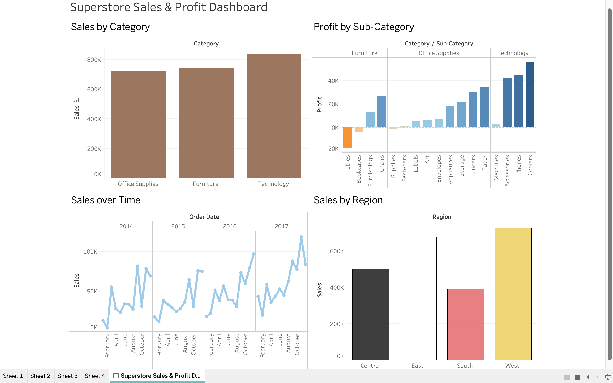

# Superstore-Sales-Profit-Dashboard

## Overview
An interactive dashboard analyzing sales and profitability for a retail 
superstore, built to identify underperforming products, seasonal trends, 
and regional performance gaps.

## Tools
Tableau

## Dashboard

## Key Findings

**1. Furniture's profitability problem is concentrated in two sub-categories.**
While Furniture, Office Supplies, and Technology are all profitable overall, 
Tables (–$17K) and Bookcases (–$3K) are actually losing money. Copiers is 
the single most profitable sub-category (+$56K).

**2. Sales spike hard every November-December.**
Every year in the dataset shows a clear seasonal peak in Q4, suggesting 
inventory and staffing should be planned around this surge.

**3. The West and East regions drive the most revenue; the South lags behind.**
West (~$725K) and East (~$680K) significantly outperform the South (~$390K), 
suggesting an opportunity to investigate what's limiting growth there — 
fewer stores, weaker marketing reach, or a genuinely smaller market.
